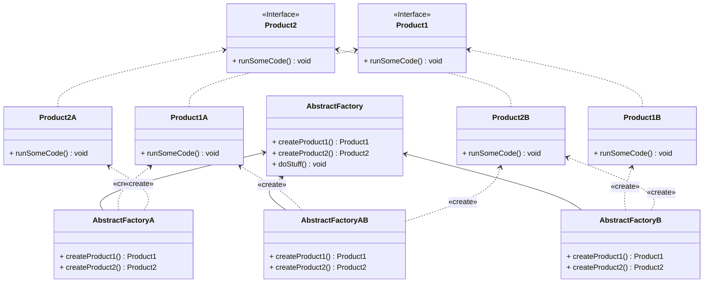

# Abstract Factory (fabrique abstraite)

- Package: [fr.fleefie.designpatterns.abstractfactory](/src/main/java/fr/fleefie/designpatterns/abstractfactory)
- Utilisation: [ExampleAbstractFactory.java](/src/main/java/fr/fleefie/designpatterns/factory/ExampleAbstractFactory.java)
- Prérequis: [Factory](/doc/Factory.md)

## Résumé

La fabrique abstraite est une variante de la fabrique, à quelques changements
près. La fabrique est adaptée aux situations où on a besoin d'un produit final
avec plusieurs variantes, mais cela implique que chaque variante doit avoir une
fabrique séparée. On va donc créer une couche d'abstraction supplémentaire.

La fabrique abstraite est une interface qui va définir quels méthodes de fabrique
une fabrique concrète va posséder. Chaqune de ces méthodes de conception retourne
un produit abstrait dans la fabrique abstraite, et une variante concrète dans les
fabriques concrètes. En d'autres termes, une fabrique abstraite permet de créer
une famille d'objets. 

Par exemple, on peut s'imaginer une fabrique abstraite pour un ordinateur. On aurait:
- Une interface "Processeur" avec des variantes concrètes AMD64, ARM et PPC
- Une interface "Mémoire" avec des variantes concrètes SDR, DDR, GDDR
- Une interface "Fabrique Ordinateur" qui possède des méthodes de fabrique pour
le processeur et la mémoire
- Des implémenations de cette fabrique, comme "Fabrique Ordinateur De Bureau" qui 
permet de créer un processeur de variante AMD64, une mémoire de variante DDR, etc.

On monte d'un niveau d'abstraction, au lieu de créer une fabrique capable de créer
un produit concret, on créer un type de fabrique qui permet de créer un ensemble
de types de produits concrets. 

## Diagrammes

## Détails

#### Intention

- Définir l'interface de création d'une famille d'objets, sans devoir spécifier
les variantes concrets de ces objets

#### Solution

- Encapsuler l'instantiation des types d'objets dans une interface qui peut
supporter plusieurs variantes pour un même objet

#### Quand l'utiliser

- Quand une classe ne peut pas savoir les types des objets d'une famille d'objets à créer
(exemple: un ensemble de trois types de meubles, chaqun avec leur propre style).
- Quand une famille de produits est concue pour être utilisée ensemble et il
est important d'imposer cela avec une seule fabrique.

On note ici que ce patterne répond à deux cas d'utilisations pourtant
opposés ; On peut à la fois imposer qu'une famille est toujours utilisée ensemble
tout comme on peut permettre de mélanger les variantes de chaque membre d'une famille
ensemble (voir le code pour un exemple, [
AbstractFactoryAB](/src/main/java/fr/fleefie/designpatterns/abstractfactory/AbstractFactoryAB.java))

#### Avantages

- Comme les variantes des produits restent abstraites, on peut très facilement
réutiliser ces variantes dans n'importe quel agencement.
- On sépare les responsabilitées de création et d'utilisation des variantes.
- Permet de créer des ensembles de produits prédéfinis.

#### Inconvénients

- Ajouter des nouvelles variantes peut être difficile car il est nécéssaire
de toucher à plusieurs classes, les changements se propagent vite.

## Relations à d'autres patternes

Une fabrique abstraite peut être implémentée de plusieurs manières. Dans cet
exemple, on utilise des méthodes de fabrique abstraites. Une alternative est
d'utiliser des fabriques simples par composition. Dans certains cas, il peut
être intéressant d'avoir une instance unique d'une fabrique abstraite, ou encore
des fabriques simples composées dans une fabrique abstraite. Dans ce cas, le
patterne [Singleton](/doc/Singleton.md) peut être utile. Si il y a un grand
nombre de familles, le [Prototype](/doc/Prototype.md) peut être utile.
