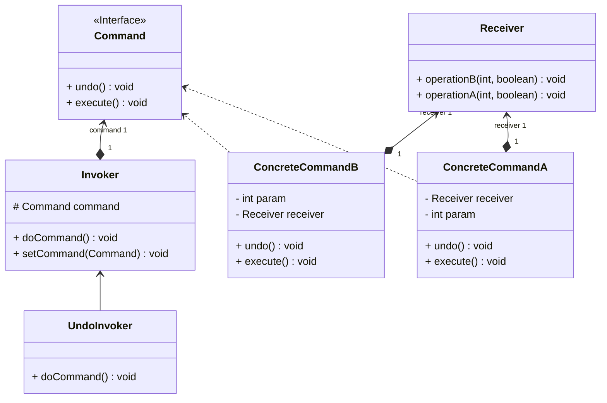

# Command / Commande

- Package: [fr.fleefie.designpatterns.command](/src/main/java/fr/fleefie/designpatterns/command)
- Utilisation: [ExampleCommand.java](/src/main/java/fr/fleefie/designpatterns/command/ExampleCommand.java)

## Résumé

Un patterne commande permet de représenter une opération en tant qu'un objet de
première classe et non juste comme une partie du flot de contrôle. On possède
un objet représentant une opération discrète qui peut être appliquée ou annulée.
Pour séparer correctement les responsabilités, on a:
- Une interface Command qui représente une commande applicable.
- Des implémentations concrètes de Command qui prennent en paramètre la classe
réceptrice, ansi que potentiellement des paramètres.
- Une classe réceptrice capable d'accepter ces commandes et potentiellement de
les annuler.
- Une classe invocatrice qui va pouvoir appliquer la commande.

On peut alors s'imaginer, par exemple, une commande pour copier du texte dans
un presse-papier, qui est acceptée par un objet représentant un document et 
invoquée par à la fois un bouton et un racourcis clavier. Ces deux invoquateurs
appellent la même commande qui communique au document qu'il faut copier, voire
qu'il faut annuler la copie et restaurer le contenu initial.

Le patterne commande, en plus de permettre de suivre un flot de commandes discret
et annulable, peut alors aussi être utilisé comme un proxy pour représenter des
commandes pas encore appliquées.

## Diagrammes

## Détails

#### Intention

- Représenter une requête comme un objet pour pouvoir la gérer dans une liste,
par exemple.
- Représenter un appel de méthode comme un objet à part entière.

#### Solution

- Représenter la requête par un objet.

#### Quand l'utiliser

c.f. résumé

#### Avantages

- c.f. résumé
- Permet de coupler des commandes ensemble pour créer des macro-commandes.

#### Inconvénients

- Comme toujours, de la complexité est ajoutée.
