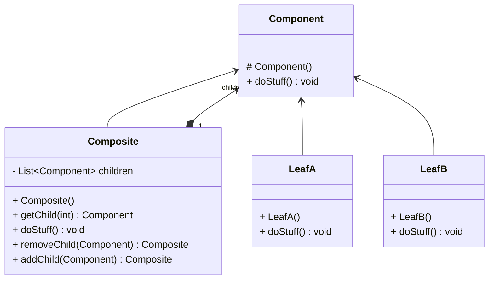

# Composite

- Package: [fr.fleefie.designpatterns.composite](/src/main/java/fr/fleefie/designpatterns/composite)
- Utilisation: [ExampleComposite.java](/src/main/java/fr/fleefie/designpatterns/composite/ExampleComposite.java)

## Résumé

Un composite est un patterne de structure qui permet de définir une arborescence
d'objets tous capable d'être traités individuellement, ou en tant que groupe.
Par exemple, imaginons-nous un point. Ce point peut être traité seul, mais peut
aussi faire parti d'une ligne. Si on souhaite afficher une ligne, on devrait alors
être capable d'afficher cette ligne de la même manière qu'un point, puis avoir
l'affichage de la ligne déléguer l'affichage de chaqun de ses points aux points.
En pseudo-code:

```java
public abstract class Affichable {
    public abstract void afficher();
}

public class Point extends Affichable {
    public void afficher() {/*...*/}
}

public class Ligne extends Affichable {
    private List<Point> points;
    public void afficher() {
        for (Point point : points)
            point.afficher();
    }
}
```

On voit ici l'idée générale du composite, mais spécialisé. De manière abstraite,
on aura une classe abstraite centrale qui représente l'interface commune d'un
composite et d'une feuille. Ensuite, on aura des classes concrètes implémentant
cette interface pour chaque feuille (ou alors une seule interface feuille elle-même
implémentée par plusieurs feuilles concrètes). Enfin, une classe concrète
composite implémentant cette même interface de composant, contenant une liste de
components (donc feuille ou composite) et qui délègue son interface à chaque
membre de cette liste.

On créé donc un arbre quelquonque où chaque noeud peut être une feuille utilisable,
ou un noeud qui, quand traité comme une feuille, traite chaqun de ses enfants
récurisvement.

## Diagrammes



## Détails

#### Intention

- Composer des objets dans une structure arborescente pour représenter
une hiérarchie.
- Permettre au client de traiter un composant et un composé de manière identique.

#### Solution

- Définir une classe abstraite qui contient le comportement commun d'un composé
et d'un composant.
- La relation de composition lie un composé à tout héritier de cette classe abstraite.

#### Quand l'utiliser

- Quand on a besoin de cette hiérarchie.
- Quand on souhaite que le client traite un composant identiquement à un composé.

#### Avantages

- Facilite l'ajout de nouveaux types de composants.
- Simplifie le code client qui ne se soucie pas de s'il traite un composant ou
un composé.
- Permet de créer tout un arbre récursivement.

#### Inconvénients

- Tout est géré par polymorphisme, donc le typage peut être difficile.
