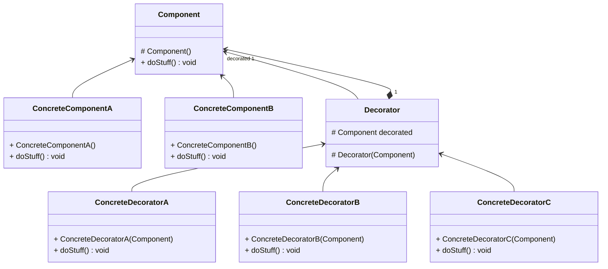

# Decorator / Décorateur

- Package: [fr.fleefie.designpatterns.decorator](/src/main/java/fr/fleefie/designpatterns/decorator)
- Utilisation: [ExampleDecorator.java](/src/main/java/fr/fleefie/designpatterns/decorator/ExampleDecorator.java)

## Résumé

Le patterne décorateur est assez complexe. Il permet d'ajouter dynamiquement des
fonctionnalitées à un composant, dit "décoré", sans avoir à créer une classe
parent. On utilise pour cela un système basé sur de l'héritage récursif.

On a deux interfaces importantes. La première représente un composant, qui est
celui qui sera décoré. Ce composant possède lui-même des implémentations concrètes.
Ce composant abstrait posède toutes les méthodes et les champs nécéssaire à
l'utilisation du composant par le décorateur. La deuxième interface est celle
du décorateur lui-même. On utilise ici une classe abstraite, car on a besoin de
pouvoir garder le composant décoré en champ. Le décorateur possède un override
sur la/les méthode/s d'utilisation du composant pour pouvoir exécuter son propre
code avant et après avoir appelé la méthode correspondante chez le décoré.

Comme nos décorateurs suivent l'interface d'un décorateur, qui elle même suit
l'interface d'un composant, on peut traiter nos décorateurs comme des composants
eux-même, ce qui veut dire qu'on peut décorer un décorateur exactement comme
on décore un composant. En d'autres termes, on est capable de décoréer récursivement:

```java
        // Extrait adapté de ExampleDecorator.java
        Component comp = new ConcreteComponent();
        comp.doStuff();
        
        Component decorated = 
            new ConcreteDecoratorA(
                    new ConcreteDecoratorB(
                        comp));

        decorated.doStuff();
```

## Diagrammes




## Détails

#### Intention

- Ajouter dynamiquement des fonctonnalités suplémentaires à un objet.
- Pouvoir composer des fonctionnalités sans passer par l'héritage en tant
qu'extension.

#### Solution

- Permettre l'extension par une chaine de fonctionnalité à partir de l'objet de
base.

#### Quand l'utiliser

- Quand on veut ajouter des responsabilités sans changer du code existant.
- Quand créer une classe spécialisée n'est pas pratique (souvent car il y a trop
de combinaisons possibles).

#### Avantages

- Plus flexible que de l'héritage statique.
- Evite de créer des classes surchargées.

#### Inconvénients

- Comme le système est composé de beaucoup de petits objets, il devient très
vite difficile à comprendre et à déboguer.
- L'interface d'un objet décoré doit être identique à celle du décorateur, donc
on peut manquer de fonctionnalités spécifiques (en d'autre termes, un décorateur
étant une enveloppe transparente par design, cela peut poser problème).
- Il est difficile de créer une décoration qui dépend d'une autre sans casser la chaîne.
