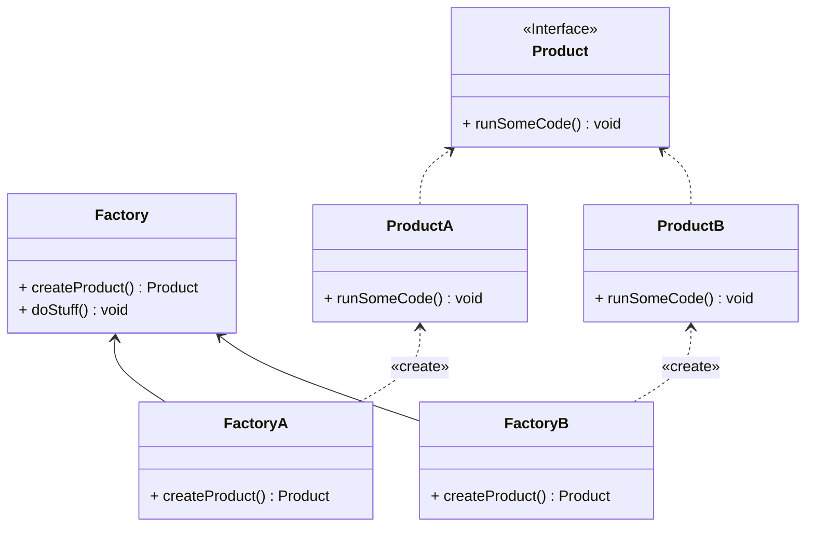

# Factory (fabrique)

Package: [fr.fleefie.designpatterns.factory](/src/main.java/fr/fleefie/designpatterns/factory)
Utilisation: [ExampleFactory.java](/src/main.java/fr/fleefie/designpatterns/factory/ExampleFactory.java)

## Résumé

Une fabrique à pour but de séparer la logique de création d'un produit du
produit en lui-même en passant par une classe dédiée à l'instantiation d'un
nouveau produit. 

## Diagrammes

## Détails

### Description

#### Intention

- Définir l'interface de création d'un objet, en laissant des sous-classes décider
du sous-type de produit à créer.

#### Solution

- Encapsuler l'instantiation d'objets dans une classe abstraite dédiée.

#### Quand l'utiliser

- Quand une classe ne peut pas savoir la classe d'objet à créer (exemple: une
livraison qui doit contenir un moyen de livraison inconnu).
- Quand une classe attend de ses héritiers qu'ils spécifient quels objets ils
crééent (exemple: expansion d'une fonctionalitée d'une bibliothèque).

#### Avantages

- Comme le produit final reste abstrait, on gagne en réutilisabilité du code.
- Le client ne dépend que de l'interface Product, simplifiant donc l'utilisation
de ses variantes, peu importe la fabrique utilisée.

#### Inconvénients

- Si les fabriques ne sont pas assez paramétrisées, le client peut avoir à créer
des sous-classes de fabrique pour instancier un produit particulier, donc le
patterne devient redondant !
- L'utilisation de fabriques rend le code très compliqué, l'introduire dans une
base de code existante est donc un travail assez lourd.
