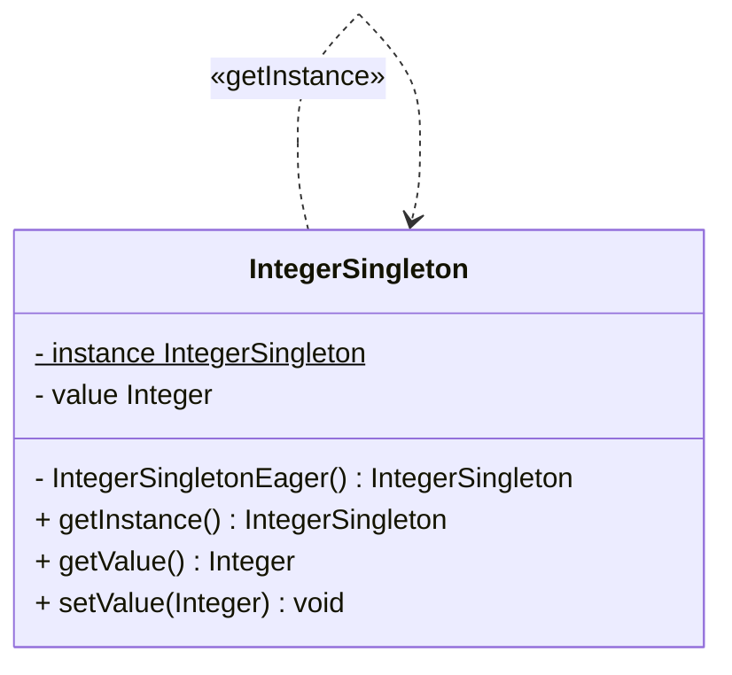

# Singleton

- Package: [fr.fleefie.designpatterns.singleton](/src/main/java/fr/fleefie/designpatterns/singleton)
- Utilisation: [ExampleSingleton.java](/src/main.java/fr/fleefie/designpatterns/singleton/ExampleSingleton.java)

## Résumé

Un singleton est tout aussi simple à implémenter qu'à expliquer. Il s'agit
d'une classe qui permet de s'assurer que toutes ses instances se réfèrent au
même objet. Un singleton s'implémente en rendant le constructeur privé, en
gardant une référence statique vers l'instance unique, et en ajoutant une 
méthode de classe/statique qui permet de récupérer cette instance. Le code 
ci dessous est suffisant pour réprésenter un singleton sans données atachées:

```java
public class Singleton {
    private static Singleton instance = new Singleton();
    private Singleton();
    public static Singleton getInstance() { return instance; }
}
```

Au delà de l'instantiation, il est utilisable comme une classe comme une autre,
y compris étant héritable et pouvant posséder des champs et des méthodes d'instance.

Une complexité du singleton est la question de quand l'instancier. Il existe deux
réponses à cette question:
- Une instantiation aggresive (eager), où on instancie le singleton directement
dans la déclaration de l'instance unique.
- Une instantiation passive (lazy), où on instancie le singleton seulement quand
on cherche à obtenir l'instance.

Si l'objet est assez gros, l'instancier dès que possible peut poser problème.
Mais si il est assez petit, vérifier si l'instance est non-nulle à chaque instantiation
peut être plus coûteux, et de plus il faut proprement verrouiller les processus
dans une application multi-threadée !

## Diagrammes




## Détails

#### Intention

- Garantir qu'une classe ne possède qu'une seule instance, mais plusieurs références
accessible de la mème manière et de n'importe où dans le code.

#### Solution

- Créer un pseudo-constructeur statique qui garanti qu'on retourne la même
instance à chaque fois.

#### Quand l'utiliser

- Quand on veut garantir qu'une classe n'a qu'une seule instance, mais plusieurs
points d'accès.
- Quand on veut que cette classe soit extensible par héritage et facilement composable.

#### Avantages

- Permet d'éviter de créer des variables globales.
- Permet de dompter la séparation statique vs globale de Java.
- Permet un nombre variable d'instances de références vers le singleton.

#### Inconvénients

- Comme Java est un langage de programmation terriblement mauvais, il est 
impossible de modifier le retour du constructeur. On passe donc par une méthode
remplacant le constructeur, ce qui n'est pas forcément naturel, mais semblable
à une [Fabrique](/doc/Factory.md). Dans un langage plus correct, on pourrait 
simplement modifier le retour du constructeur...
